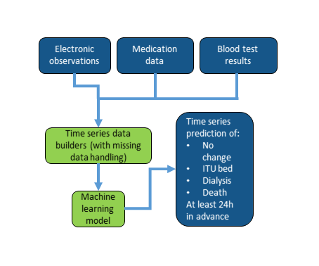
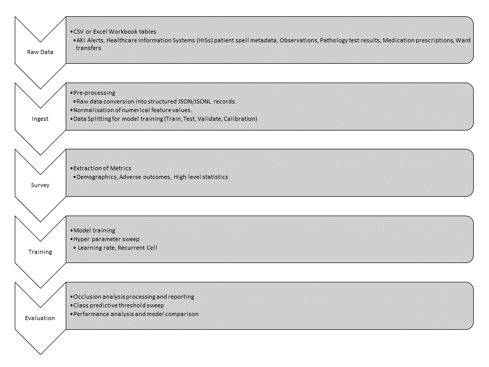

[](LICENSE)
[](https://www.python.org/downloads/release/python-375/)
<!-- Add in additional badges as appropriate -->


# NHS AI Lab Skunkworks project: Predictive Renal Health

> A pilot project for the NHS AI (Artificial Intelligence) Lab Skunkworks team, Predictive Renal Health seeks to build a machine learning model to assist in identifying those acute kidney injury (AKI) patients at higher risk of requiring ITU, needing renal support (dialysis), or likely to have a higher potential for mortality.

Predictive Renal Health was selected as a project in Spring 2022 following a succesful pitch to the AI Skunkworks problem-sourcing programme.

This project is based upon work by Google's DeepMind as "Modeling for Electronic Health Records Predictions" available publically under the Apache-2.0 licence [here](https://github.com/google/ehr-predictions/modeling)

## Intended Use

This proof of concept ([TRL 4](https://en.wikipedia.org/wiki/Technology_readiness_level)) is intended to demonstrate the technical validity of applying the deep recurrent network approach defined by the DeepMind group [^1] with modifications, against a dataset of electronic healthcare records, blood test results, and medication data, in order to predict downstream events of acute kidney injuries including the need for intensive care, dialysis or death with 24h or more notice.

It is not intended for deployment in a clinical or non-clinical setting without further development and compliance with the [UK Medical Device Regulations 2002](https://www.legislation.gov.uk/uksi/2002/618/contents/made) where the product qualifies as a medical device.

## Data Protection

This project was subject to a Data Protection Impact Assessment (DPIA), ensuring the protection of the data used in line with the [UK Data Protection Act 2018](https://www.legislation.gov.uk/ukpga/2018/12/contents/enacted) and [UK GDPR](https://ico.org.uk/for-organisations/dp-at-the-end-of-the-transition-period/data-protection-and-the-eu-in-detail/the-uk-gdpr/). No real world data or trained models are shared in this repository.

A minimal selection of testing data is included on an example basis, with only minimal examples of the types of fields required and/or available at the time of development. See example instructions below on how to evaluate the tool with these placeholder examples.

## Background

Deterioration of AKI patients is hard to predict, leading to outcomes such as the need for emergency admission to ITU and need for organ support such as dialysis.
The aim of this commission is to understand the likelihood/risk of AKI patients who will need ITU admission, dialysis or die.

Currently available tools include AKI alerts, which identify patients who have developed kidney disease based on serial blood tests, and the Early Warning Score (EWS) that collates multiple
observations such as blood pressure, pulse and heart rate based on predefined parameters at a single time point.
Though these do allow for alerting of potentially unwell patients, often these arrive too late to change the course of clinical treatment as the patient’s situation has already deteriorated, and
therefore the opportunity to reduce severity of deterioration is limited.

A Proof-of-Concept tool is needed that can help identify (more than 24hrs in advance) those AKI patients at higher risk of the aformentioned outcomes. This projects seeks to develop such a tool.


## Model selection

The approach is based around extending a highly-cited method from DeepMind in 2019 [^1], which predicted incidences of AKI from data which is expected to have partial overlap in structure with this commission’s dataset. Though the prediction task here is a step beyond predicting AKIs, the challenge is closely related and similar models are expected to be viable after some modification.


## Known limitations

The following limitations are known regarding the current implementation of the tool and the experiments available.

CLI Tool:
* The CLI tool currently does not support running any curriculum learning experiments.
* Only minimal configuration parameters are available at runtime through the CLI tool (such as data and output directories, flags for types of processing, training step count). Any further adjustment must be done through the individual task script and/or through the `config.py` file within the `aki_predictions/ehr_prediction_modeling` directory.

Data Ingest:
* The current data ingest tool does not automatically populate numerical labels (such as lab result prediction labels).

Model training:
* Curriculum learning has been implemented within the standalone training script (`aki_predictions/training/multiple_adverse_outcomes_w_curriculum.py`). This is a work in progress, as development was directed elsewhere during the project, and training performance was seen to be suitable without inclusion in the main pipeline. Performance was decreased with curriculum learning in place. This has been theorized to be potentially due to the severe class imbalance negatively impacting the 'hard example mining' technique for 'difficult' case discovery.
* The lab result prediction labels are not implemented within the data loader and therefore not included in the model training pipeline.
* The `missing_metadata_mapping.json` and `sequence_giveaways.json` files are not automatically generated by the tool and need to be manually populated with the appropriate information (see pipeline guide below).

## Data pipeline




## Processing pipeline

The diagram below shows the series of stages available within the CLI tool pipeline. These include ingest, survey, training, and evaluation.



### RAW Data Structure

The RAW data is expected to be in the structure of CSV or Excel workbook data tables.
Excel workbook files may have extra header lines above the table, which can be skipped through a data configuration option on ingest.
CSV files may not have any additional non-header rows above table headers.

### Ingested data structure

An example of the structure for ingested data records is shown below in indented form.
When ingested this structure is represented as a single JSON line within a JSONL data file (examples in `tests/fixtures/test_data_ingest_output/`)

```
{
    "record_number": "1",
    "metadata_1": "VALUE_3",
    "year_of_birth": "1200",
    "episodes": [
        {
            "events": {
                "patient_age": "345678",
                "time_of_day": "1",
                "entries": [
                    {
                        "feature_category_idx": "2",
                        "feature_idx": "1",
                        "feature_value": "4"
                    },
                    {
                        "feature_category_idx": "2",
                        "feature_idx": "1",
                        "feature_value": "4"
                    }
                ],
            }
            "labels": {
                "adverse_outcome": "0",
                "adverse_outcome_dialysis_within_12h": "0",
                "adverse_outcome_dialysis_within_18h": "0",
                "adverse_outcome_dialysis_within_24h": "0",
                "adverse_outcome_dialysis_within_30h": "0",
                "adverse_outcome_dialysis_within_36h": "0",
                "adverse_outcome_dialysis_within_42h": "0",
                "adverse_outcome_dialysis_within_48h": "0",
                "adverse_outcome_dialysis_within_6h": "0",
                "adverse_outcome_in_spell": "0",
                "adverse_outcome_itu_within_12h": "0",
                "adverse_outcome_itu_within_18h": "0",
                "adverse_outcome_itu_within_24h": "0",
                "adverse_outcome_itu_within_30h": "0",
                "adverse_outcome_itu_within_36h": "0",
                "adverse_outcome_itu_within_42h": "0",
                "adverse_outcome_itu_within_48h": "0",
                "adverse_outcome_itu_within_6h": "0",
                "adverse_outcome_mortality_within_12h": "0",
                "adverse_outcome_mortality_within_18h": "0",
                "adverse_outcome_mortality_within_24h": "0",
                "adverse_outcome_mortality_within_30h": "0",
                "adverse_outcome_mortality_within_36h": "0",
                "adverse_outcome_mortality_within_42h": "0",
                "adverse_outcome_mortality_within_48h": "0",
                "adverse_outcome_mortality_within_6h": "0",
                "segment_mask": "0"
            }
            "numerical_labels": {
            }
        }
    ]
}
```

## Getting Started

1. Clone this repository.
2. Switch to the required branch (default is `main` branch: `git checkout main`)
3. Create a new virtual environment (Ideally Python 3.7 for compatibility with DeepMind codebase): `python3 -m virtualenv venv`
4. Activate virtual environment (on linux environment): `source venv/bin/activate` or on Windows `.\venv\Scripts\activate.bat`
5. Install the requirements of this template: `pip install -e .[cpu]` or `pip install -e .[gpu]` depending on the installation environment.

To install requirements for testing and documentation, run `pip install -e .[tests]` and `pip install -e .[docs]` respectively.
For experimental work, `pip install -e .[experiments]` will install the nessesary components for any standalone experiments or jupyter notebooks (which would not be required for normal running of the tool).

When developing it is advised to use the `pre-commit` tooling available. Either install the test requirements, or `pip install pre-commit`, and then enable pre-commits: `pre-commit install`.
The pre-commit configuration will apply linting and general formatting checks and adjustments (using flake8 and black formatting).

## Environment

The software tools included in this repository were developed and tested using the following environment:

    * Ubuntu 18.04 LTS
    * Python 3.7
    * CUDA 10.0
    * cudnn 7.6.5

A requirements file is included detailing the test environment used. The `setup.py` file contains the relevant package dependencies required for this codebase.

## Automated tests

This project uses PyTest to run automated testing across the tools developed.

To run these tests from within the installed environment:

```
pip install -e .[tests]
pytest --cov-report term-missing --cov=aki_predictions --junitxml=report.xml tests/
```

To run code linting and checking:
```
flake8 aki_predictions tests --count --config .flake8
```

To run pre-commit code checks globally:
```
pre-commit run --all-files
```

## CLI Tool

A CLI tool has been developed to allow access to the key elements of the primary data ingest and training pipeline (additional scripting is included).

The tool includes options to trigger each key step in the pipeline:

```
usage: aki_predictions_tool [-h] [-o OUTPUT_DIR]
                            {ingest,survey,training,evaluation,inference} ...

CLI Tool for C308 Predictive Renal Health Proof of Concept v0.0.1

positional arguments:
  {ingest,survey,training,evaluation,inference}
                        pipeline commands

optional arguments:
  -h, --help            show this help message and exit
  -o OUTPUT_DIR, --output_dir OUTPUT_DIR
                        Output directory for logging.
```

The CLI tool provides minimal logging information which is saved in the appropriate `output_dir` directory as a timestamped log file for reference and/or debugging.

### Data Ingest, Normalisation, and Splitting

To ingest and prepare a dataset for training the steps are as follows:
1. Gather data files.
2. Setup configuration (a minimal example is included as a test fixture ```tests/fixtures/mock_config.json```) this includes:
    * Data sources
    * Key mapping
    * Features (metadata, numerical, categorical)
    * Numerical feature exclude list
    * Event feature definitions
    * Labelling conditions
3. For normalisation of numerical features select data capping/no capping in ```aki-predictions/data_processing/__init__.py``` (for 1st and 99th centile capping)
4. Run data ingest through the CLI tool (this ingests the data, normalises numerical features, and splits data for training/testing):
    ```
    usage: aki_predictions_tool ingest [-h] [-o OUTPUT_DIR] [-c CONFIG]

    optional arguments:
    -h, --help            show this help message and exit
    -o OUTPUT_DIR, --output_dir OUTPUT_DIR
                            Output directory for logging and artifacts.
    -c CONFIG, --config CONFIG
                            Data ingest config file location.
    ```

Alternatively this can be done standalone using the ingest and normalisation scripts:
* Ingest: ```python aki_predictions/data_processing/data_ingest.py <path to ingest config>```
* Normalisation: ```python aki_predictions/data_processing/normalise_data.py <path to ingested data directory>```
* Split data: ```python aki_predictions/data_processing/split_data.py <path to ingested data directory>```

The key output files at this point of the processing are:
* `ingest_records_output_lines.jsonl` - main output file containing a json line for each record.
* `feature_mapping.json` - feature (sequence element) index mapping.
* `numerical_feature_mapping.json` - feature index mapping for numerical features.
* `category_mapping.json` - category index mapping.
* `metadata_mapping.json` - metadata (context) feature mapping.
* `feature_statistics.json` - statistics regarding numerical features (relevant to data survey and normalisation of numerical values).

At this point the user must provide the following manually generated files:
* `missing_metadata_mapping.json` - mapping file containing the default values for when metadata fields are missing from a record.
* `sequence_giveaways.json` - dictionary containing a list of feature fields to mask out during training. This can be obtained from selecting values from the feature and metadata mapping files. This prevents unfairly biasing the model with values present in the dataset (which are relevant to labelling) but would not normally be available at inference time.

#### Ingest Configuration

The data ingest features within this codebase requires a configuration JSON to specify the data formats, locations, and pre-processing settings.
These allow the user to specify which features to extract from the raw data fields.
The user may format their data in the JSON records format, in which case they may wish to utilise the standalone entrypoints to the normalisation and data splitting scriptss prior to training.

Guidance on the configration file format is as follows (example in `tests/fixtures/mock_config.json`):

Example guidance on ingest configurations:
```
{
    "sources": [
        {
            "filepath": "<data path>" (can be list of file paths to concatenate- for files with matching schemas),
            "skiprows": <number of rows to skip>, (excel only)
            "name": "<short name for data file, used as data key>",
            "master_key": "<field to use as master key field>"
            "secondary_key": "<used to state that the secondary key should be used for this source>"
            "concatenate_columns": [{ (used to concatenate a combination of columns on data load - assumes strings)
                "field": "<new field name>",
                "values": [ (assumes concatenating in order of list)
                    ... (column names to concatenate)
                ],
                "seperator": <seperator to add between string columns>
            }, ... (can be list of column pairs to combine with concatenate_columns) ],
            "drop_columns": [] (list of column names from source to drop on load - for efficiency of indexing)
            "split_columns": [ {
                "value": "<column name>",
                "fields": [
                    ... (list of fields in order to split)
                ],
                "delimiter": "-"
                }, ... (can be list of columns to split with split_columns)
            ],
            "str_lookup": {
                "type": "metadata",
                "filepath": "<filepath>", (lookup table)
                "name": "<name of table>",
                "primary_key": "<primary lookup column>",
                "secondary_key": "<secondary lookp column>",
                "value": "<column to look up values from>",
                "field": "<column name>", (new column to populate with detected primary keys)
                "delimiter": "," (delimiter to use when detecting more than one value from lookup list in value column)
            },
            "remove_duplicates": [column name, column name]
        }
        ... (can be list of files)
    ],
    "mapping": {
        "master_key": {
            "source": "<source for master key",
            "field": "<master key for unique data record", (master key to use to select row in source table)
            "filter_rules": [ (rules on leaving out records relating to specific master keys)
                {
                    "description": "<description>",
                    "source": "<source name>",
                    "field": "<master key field>",
                    "query_field": "<query field to look in>",
                    "drop_values": [
                        ... (list of values to detect)
                    ]
                },
                {
                    "description": "<description>",
                    "source": "<source name>",
                    "field": "<master key field>",
                    "query_field": "<query column name>",
                    "remove_if_populated": "True"
                }
            ]
        }
        "secondary_key": {
            "source": "<source for secondary key - must be same as master key>",
            "field": "<secondary key for unique data record>", (must be from same source as master key, mapped together)
        }
        "numerical_features": [
            <list of numerical output feature names in any order,
            these will map to feature indexes depending on the order>
        ],
        "numerical_feature_exclude_list": {
            "<feature_name>": [
                (list of string values to ignore when finding feature entries)
            ],
            ... (allows multiple features)
        }
        "categorical_features": [ (these features will have name and value
                                    used to assign an index for the value in the categorical feature
                                    value mapping table)
            {
                "name": "<feature name>",
                "source": "<source sheet>",
                "field": "<field in source>"
            },
        ]
        "metadata": {
            "<field name in new data record>": {
                "source": "<short name of data file (see above)",
                "field": "<name of field to extract>"
            },
            ... (can have multiple metadata keys)
        }
        "events": [
            {
                "category": "<category of event>",
                "source": "<short name of data file (see above)",
                "datetime": "<field in source to use as timestamp>"
                "features": [
                    {
                        "name": "<feature name>",
                        "field": "<field to access in data>",
                        "type": "<numerical or categorical, this will determine how to handle one hot encoding>"

                    },
                    ... (multiple allowed)
                ]
            },
            ... (multiple allowed)
        ],
        "labelling": { (labelling is largely based on categorical feature values)
            "labels": {
                "of_interest": "<adverse outcome of interest>",
                "output_of_interest": "<Source data to export for keys of interest>",
                "master_key_of_interest": "<Master key column for specific source>",
                "adverse_outcome": {
                    "time_step": "6", (gap in hours between outcome labels)
                    "max_look_ahead": "8", (number of periods to look ahead for labelling)
                    "labels": {
                        "<adverse outcome name>": {
                            "name": "<feature name to look at>",
                            "values": ["<value of categorical feature>"],
                            "metadata": [
                                <list of metadata feature names to presence check as secondary rule>
                            ]
                        },
                        ... (multiple adverse outcomes allowed)
                    }
                }
            },
            "numerical_labels": {
            }
        }
    }
}
```

### Model Training

The following steps are available to run the default training pipeline:
1. Set configuration values within specific training experiment:
    * Paths to data directory
    * Hyperparameters
2. Trigger a training pipeline through the CLI tool:
    * Choose a training pipeline:
    ```
    usage: aki_predictions_tool training [-h] {default,hyperp,recurrent_cell} ...

    positional arguments:
    {default,hyperp,recurrent_cell}
                            training commands

    optional arguments:
    -h, --help            show this help message and exit
    ```
    * Choose specific options for training:
    ```
    usage: aki_predictions_tool training default [-h] [-o OUTPUT_DIR] [-d DATA]
                                                [-s STEPS] [-c CONTEXT]
                                                [--checkpoint_every CHECKPOINT_EVERY]
                                                [--eval_every EVAL_EVERY]
                                                [--summary_every SUMMARY_EVERY]

    optional arguments:
    -h, --help            show this help message and exit
    -o OUTPUT_DIR, --output_dir OUTPUT_DIR
                            Output directory for logging and artifacts.
    -d DATA, --data DATA  Data location (training data location).
    -s STEPS, --steps STEPS
                            Training steps.
    -c CONTEXT, --context CONTEXT
                            Include context features in training (True, False).
    --checkpoint_every CHECKPOINT_EVERY
                            Save checkpoint every 'x' training steps.
    --eval_every EVAL_EVERY
                            Evaluate model performance every 'x' training steps.
    --summary_every SUMMARY_EVERY
                            Save summary events every 'x' training steps.
    ```

Alternatively it is possible to trigger a standalone training run:
* ```python aki_predictions/training/<training experiment>.py```

### Data Exploration

Steps to trigger data exploration tooling:

To trigger metrics extraction through the CLI tool:
    ```
    usage: aki_predictions_tool survey [-h] [-o OUTPUT_DIR] [-d DATA]

    optional arguments:
    -h, --help            show this help message and exit
    -o OUTPUT_DIR, --output_dir OUTPUT_DIR
                            Output directory for logging and artifacts.
    -d DATA, --data DATA  Data location (ingest output).
    ```

Note: If numerical feature distribution plots are desired:
    ```python aki_predictions/data_processing/extract_plotting_data.py --plot_dir=<output dir for plots> --raw_data=<path to data file> --wcap=True (optional argument for applying capping to numerical values) --feature_map=<path to numerical feature mapping file>```

Note: The metrics extraction can be run standalone:
    ```python aki_predictiona/data_processing/extract_metrics.py <output_dir> <path to ingested data directory>```

### Model Evaluation

The model evaluation tools available include options for plotting performance metrics, running occlusion analysis, and comparing scoring metrics across models.

Model evaluation steps can be triggered through the CLI tool:
    ```
    usage: aki_predictions_tool evaluation [-h]
                                       {performance_evaluation,occlusion_processing,occlusion_reporting,performance_comparison}
                                       ...

    positional arguments:
    {performance_evaluation,occlusion_processing,occlusion_reporting,performance_comparison}
                            evaluation commands

    optional arguments:
    -h, --help            show this help message and exit
    ```

To run occlusion analysis processing (includes generation of reporting):
    ```
    usage: aki_predictions_tool evaluation occlusion_processing
        [-h] [-o OUTPUT_DIR] [-d DATA] [-s STEPS] [-c CONTEXT]

    optional arguments:
    -h, --help            show this help message and exit
    -o OUTPUT_DIR, --output_dir OUTPUT_DIR
                            Output directory for logging and artifacts.
    -d DATA, --data DATA  Data location (training data location).
    -s STEPS, --steps STEPS
                            Training steps for occlusion processing (must equal
                            original training steps.).
    -c CONTEXT, --context CONTEXT
                            Include context features in occlusion analysis (True,
                            False).
    ```

To run occlusion analysis reporting (if standalone occlusion analysis has already been performed. Normalises, sorts and maps the feature names to friendly names.):
    ```
    usage: aki_predictions_tool evaluation occlusion_reporting [-h]
                                                            [-o OUTPUT_DIR]
                                                            [-f FEATURE]
                                                            [-d METADATA]
                                                            [-m METRICS]
                                                            [-c CONTEXT]

    optional arguments:
    -h, --help            show this help message and exit
    -o OUTPUT_DIR, --output_dir OUTPUT_DIR
                            Output directory for logging and artifacts.
    -f FEATURE, --feature FEATURE
                            Feature mapping file.
    -d METADATA, --metadata METADATA
                            Metadata mapping file.
    -m METRICS, --metrics METRICS
                            Occlusion analysis metrics file.
    -c CONTEXT, --context CONTEXT
                            Include context features in occlusion analysis (True,
                            False).
    ```

Standalone occlusion analysis operation:
* The occlusion analysis can be run standalone if required:
    ```python aki_predictions/training/multiple_adverse_outcomes_occlusion_analysis.py <output_dir> <data_dir> <steps>```
* Along with the reporting step:
    ```python aki_predictions/evaluation/occlusion_analysis.py <output_dir> <feature mapping file> <occlusion output file>```

To run threshold sweep (for different class prediction thresholds):
    ```
    usage: aki_predictions_tool evaluation threshold_sweep [-h] [-o OUTPUT_DIR]
                                                        [-d DATA] [-s STEPS]
                                                        [-c CONTEXT]

    optional arguments:
    -h, --help            show this help message and exit
    -o OUTPUT_DIR, --output_dir OUTPUT_DIR
                            Output directory for logging and artifacts.
    -d DATA, --data DATA  Data location (training data location).
    -s STEPS, --steps STEPS
                            Training steps for threshold sweep (must equal
                            original training steps.).
    -c CONTEXT, --context CONTEXT
                            Include context features in threshold sweep. Must
                            match original training. (True, False).
    ```

Generation of performance plots:
    ```
    usage: aki_predictions_tool evaluation performance_evaluation
       [-h] [-o OUTPUT_DIR] [-m METRICS]

    optional arguments:
    -h, --help            show this help message and exit
    -o OUTPUT_DIR, --output_dir OUTPUT_DIR
                            Output directory for logging and artifacts.
    -m METRICS, --metrics METRICS
                            Metrics file.
    ```

To generate performance plots standalone:
* Generate performance plots for a given model/metrics file:
    ```python aki_predictions/evaluation/performance_metrics.py <path to metrics file>```

To compare models:
    ```
    usage: aki_predictions_tool evaluation performance_comparison
       [-h] [-o OUTPUT_DIR] [-a ADVERSE_OUTCOME] [-m METRICS [METRICS ...]]

    optional arguments:
    -h, --help            show this help message and exit
    -o OUTPUT_DIR, --output_dir OUTPUT_DIR
                            Output directory for logging and artifacts.
    -a ADVERSE_OUTCOME, --adverse_outcome ADVERSE_OUTCOME
                            Type of adverse outcome to compare.
    -m METRICS [METRICS ...], --metrics METRICS [METRICS ...]
                            List of metric file arguments.
    ```

To compare models using the defined scoring metrics standalone:
* Compare performance of model using metrics file:
    ```python aki_predictions/evaluation/evaluate_models.py -o <output_dir> -m <paths to individual metrics files, does support wildcards>```

### Inference Mode

Inference mode allows the user to input an alternate set or subset of data to process through a given model.
Whilst this does rely on the training infrastructure (use of model checkpoints and the monitored training session for processing), it does allow ingestion of alternative data through the model.
This could be alternative data files or sets of data.

To run inference:
* The CLI tool allows running of inference tasks, outputting a raw file of predictions for each record and desired outcome.
    ```
    usage: aki_predictions_tool inference [-h] [-o OUTPUT_DIR] [-m MODEL]
                                        [-d DATA] [-s STEPS] [-c CONTEXT]

    optional arguments:
    -h, --help            show this help message and exit
    -o OUTPUT_DIR, --output_dir OUTPUT_DIR
                            Output directory for logging and artifacts.
    -m MODEL, --model MODEL
                            Model directory (containing relevant model checkpoint
                            to use for inference
    -d DATA, --data DATA  Data location (path to directory which should also
                            contain mapping files required).
    -s STEPS, --steps STEPS
                            Step count (match model training step count).
    -c CONTEXT, --context CONTEXT
                            Include context features in inference. Must match
                            original training. (True, False).
    ```
* The tool will output the file named: `inference_predictions.json` within the model directory.

## Example pipeline

Use the following steps to run the example pipeline using fake test data.
This test data is included in ```tests/fixtures/```

An integrated example is available in the `tests/test_end_to_end_pipeline/test_end_to_end_pipline.py`.

**NOTE**: to use an alternative model for downstream processing (different to the final step checkpoint) the following steps are required prior:

* Train model as normal
* Select model using evaluation methods
* Move/remove model checkpoints from the training output directory later than the chosen step.
* Modify the ```checkpoints.txt``` file within the training directory to reference the chosen checkpoint step, and remove later checkpoint entries.

### Ingest

Create directory for data pipeline (adjust as desired):
```
mkdir demonstration
```

Triggering a data ingest:
```
aki_predictions_tool ingest --output_dir demonstration --config tests/fixtures/mock_config.json
```

After triggering a data ingest, if training with context features is desired, then a ```missing_metadata_mapping.json``` is required to be present in the ingest output directory.
And example of this is shown in ```tests/fixtures/test_data_ingest_output/missing_metadata_mapping.json```.

### Survey

Triggering the metric extraction survey:
```
aki_predictions_tool survey --output_dir demonstration --data demonstration/mock_config_<relevant timestamped directory>
```

### Training

Running a default training experiment:
```
aki_predictions_tool training default --output_dir demonstration --data demonstration/mock_config_<relevant timestamped directory> --steps 100 --checkpoint_every 100 --eval_every 100 --summary_every 10 --context True
```

### Occlusion analysis

Running occlusion analysis using a trained model:
```
aki_predictions_tool evaluation occlusion_processing --output_dir demonstration --data demonstration/mock_config_<relevant timestamped directory> --steps 100 --context True
```

This will generate a json file in the output directory containing the occlusion analysis feature scores.

### Evaluation

Running model selection (use `-a` option to specify outcome) for all metrics files within the training output directory:
```
aki_predictions_tool evaluation performance_comparison --output_dir demonstration --data demonstration/mock_confic_<relevant timestamped directory> -a "mortality" -m demonstration/checkpoints/ttl=120d/train/metrics-*-0.5.json
```

Once a step has been chosen, the confusion, ROC, and PR plots can be generated:
```
aki_predictions_tool evaluation performance_evaluation --output_dir demonstration --data demonstration/mock_confic_<relevant timestamped directory> -m demonstration/checkpoints/ttl=120d/train/metrics-100-0.5.json
```

### Threshold Sweep

For a chosen model, the threshold sweep can be run to generate metrics files for a range of class prediction levels.

Assuming the latest model is the best model:
```
aki_predictions_tool evaluation threshold_sweep --output_dir demonstration --data demonstration/mock_confic_<relevant timestamped directory> --steps 100 --context
```

The evaluation steps above can now be run on the metrics files generated at different class prediction thresholds.

### Inference

To run inference with a trained model, first run the above steps to ingest data, train a model.

Inference mode requires the data to be provided within the ingest directory as a JSONL records file: ```ingest_records_output_lines_inference_uncapped.jsonl```.

Then trigger an inference run:
```
aki_predictions_tool --output_dir demonstration --data demonstration/mock_confic_<relevant timestamped directory> --model demonstration/checkpoints/ttl=120d/train/ --steps 100 --context
```


## NHS AI Lab Skunkworks

The project is supported by the NHS AI Lab Skunkworks, which exists within the NHS AI Lab at the NHS Transformation Directorate to support the health and care community to rapidly progress ideas from the conceptual stage to a proof of concept.

* Find out more about the [NHS AI Lab Skunkworks](https://transform.england.nhs.uk/ai-lab/ai-lab-programmes/skunkworks/).
* Join our [Virtual Hub](https://future.nhs.uk/connect.ti/system/text/register) to hear more about future problem-sourcing event opportunities.
* Get in touch with the Skunkworks team at [england.aiskunkworks@nhs.net](mailto:england.aiskunkworks@nhs.net).

## Licence

Unless stated otherwise, the codebase is released under [the MIT Licence][mit].
This covers both the codebase and any sample code in the documentation.

The documentation is [© Crown copyright][copyright] and available under the terms
of the [Open Government 3.0][ogl] licence.

[mit]: LICENCE
[copyright]: http://www.nationalarchives.gov.uk/information-management/re-using-public-sector-information/uk-government-licensing-framework/crown-copyright/
[ogl]: http://www.nationalarchives.gov.uk/doc/open-government-licence/version/3/

[^1]: https://doi.org/10.1038/s41586-019-1390-1
